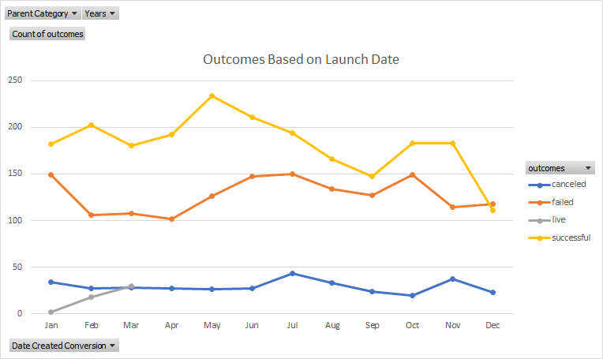
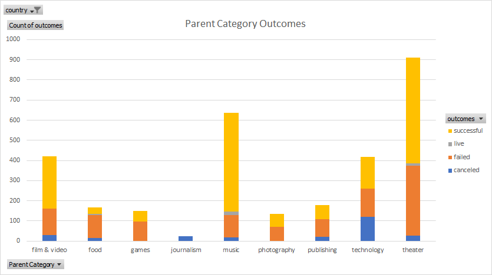

# An Analysis of Kickstarter Campaigns
Performing analysis on Kickstarter data to uncover trends and make recommendations for Louise's campaign

## Outcomes based on Launch Date

## Outcomes based on Parent Category

## Summary
Based on the analysis performed, it would benefit Louise to launch her campaing in the month of May.

Being in theater category and play subcategory, Louise will have around a 60% chance of succeeding in the US.

Louise can also improve her chances of succeeding by lowering the amount that she'd like to raise. Analyzing the data of her favorite GB plays, tells us that her goal should be less than $4,000. The average goal for those was $4,060 and the highest pledged amount that does not include outliers is $3,015.
